# codePathweek78

 WordPress vs. Kali
 
 **Homework Instructions**: 

For these week's assignment, discover and demonstrate similar proofs-of-concept for at least an additional three and (up to five) exploits affecting an older version of WP.

All exploits were tested and implemented within a WPDistillery 4.2 environment.

**1. HTTP GET Request through author id**
* Exploit Summary: Obtain information about User ID through the author interface
  * Type: User Enumeration
  * Fixed in version: N/a
  * OSInt Recon: [Author Enumeration](https://perishablepress.com/stop-user-enumeration-wordpress/)
* Gif: 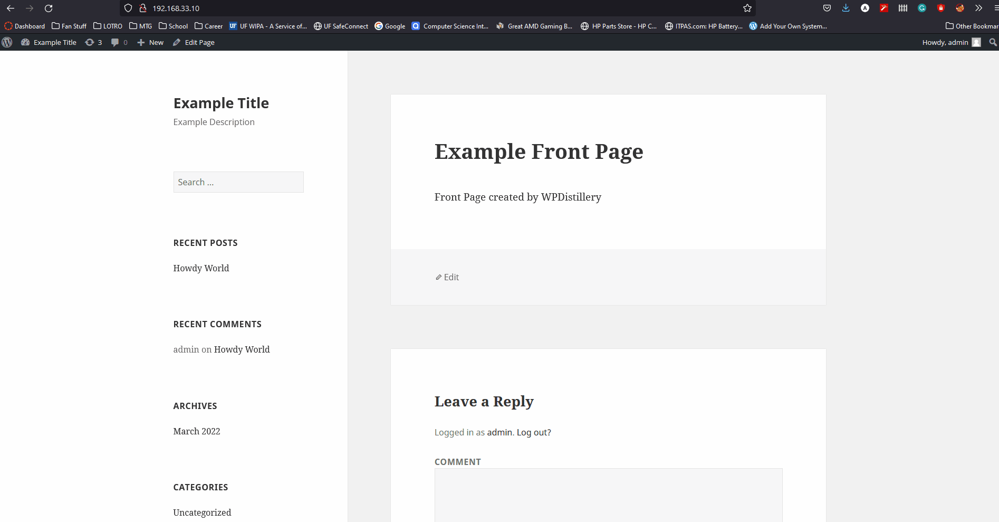
* Steps to Recreate: 
  * In browser, enter ```192.168.33.10?author=<author id>```
  * Change ```<author id>``` to a numerical value. I used ```<1>```
  * Observe the page as redirected where admin is returned user.

**2. Wordpress CodeArt Plugin IDOR**
* Exploit Summary: Obtain access to WP config file with authentication keys
  * Type: IDOR
  * Fixed in version: N/a
  * Plugin version: 1.0.11
  * OSInt Recon: [IDOR](https://www.exploit-db.com/exploits/35460)
* Gif: 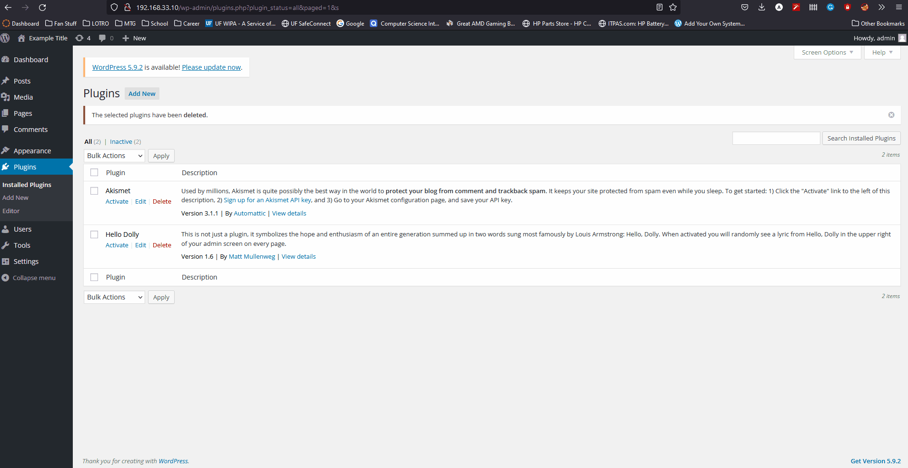
* Steps to Recreate: 
  * Install [CodeArt Plugin](https://github.com/ArtemSkit/CSCI4349_Week7/blob/master/plugins_repo/google-mp3-audio-player.zip)
  * Guest user can use the following link to access the WP config file. ```http://wpdistillery.vm/wp-content/plugins/google-mp3-audio-player/direct_download.php?file=../../../wp-config.php```

**3. Login Error Messages**
* Exploit Summary: Obtain information about users for the site
  * Type: User Enumeration
  * Fixed in version: N/a
  * OSInt Recon: [CVE-2009-2335](https://cve.mitre.org/cgi-bin/cvename.cgi?name=CVE-2009-2335)
* Gif: 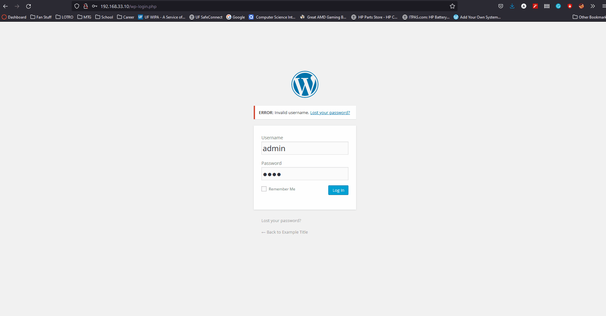
* Steps to Recreate: 
  * Navigate to the WP Login page ```http://192.168.33.10/wp-login.php?loggedout=true```
  * Typing in a username known to exist and a random password results in the following message being sent: **ERROR: The password you entered for the username admin is incorrect**.
  * Typing in a username known to not exist and a random password results in the following message being sent: **ERROR: Invalid username**.

**4. WordPress 4.2 Path Traversal + Directory Listing + File Deletion Vulnerabilities **
* Exploit Summary: 
  * Type: IDOR and Directory Traversal
  * Fixed in version: N/a
  * OSInt Recon: [IDOR Traversal](https://www.homelab.it/index.php/2014/08/06/wordpress-3-4-vulnerabilities/)
* Gif: 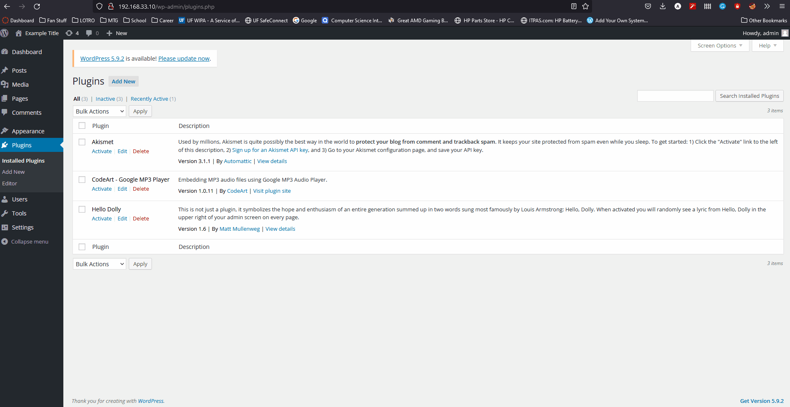
* Steps to Recreate: 
  * Choose a plugin
  * Choose both the 'deactivate' and 'delete' options
  * Change the plugin location with the target directory to be deleted
    * An example of this is changing the ```akismet%2Fakismet.php``` to ```/../../wp-admin/plugins.php``` 
**5. Directory Traversal and Exposure**
* Exploit Summary: 
  * Type: Information Exposure
  * Fixed in version: N/a
  * OSInt Recon: [CVE-548](https://cwe.mitre.org/data/definitions/548.html)
* Gif: 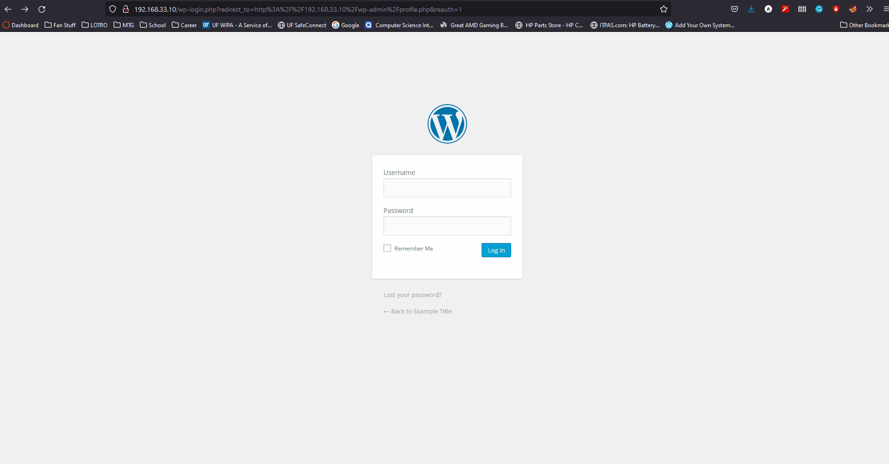
* Steps to Recreate: 
  * Navigate to ```192.168.33.10/wp-admin/cs``` or ```192.168.33.10/wp-admin/js```
  * Observe the files available to through the page
  # codePathweek9

 Pentesting Live Targets
 
 **Homework Instructions**: 

Get hands-on experience with some of the most common security exploits through an applied hacking exercise.
For this assignment, you will attack three live targets, each of which is a slightly modified version of the same web application, Globitek. The three targets are therefore mostly identical. However, each target has been given a different color menu bar—blue, green, red—and each one has two different security vulnerabilities.

All exploits were tested and implemented within either the https://35.184.88.145/ or https://104.198.208.81/ addresses on the Green, Red, or Blue site.  

**1. Username Enumeration**
* Exploit Summary: Obtain information about valid usernames via Login message system
  * Site: GREEN
* Gif: 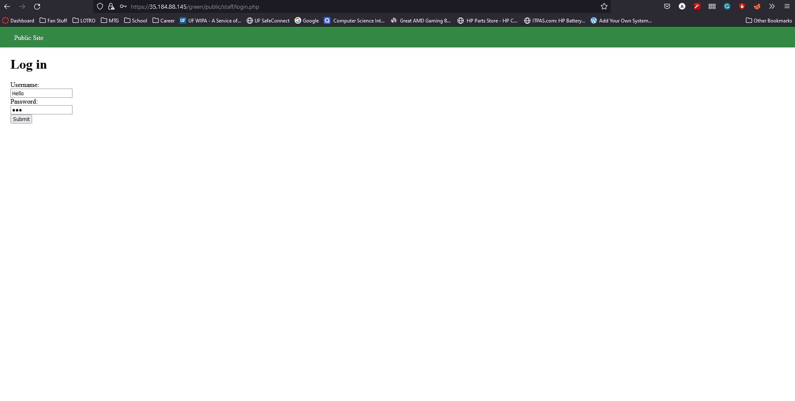
* Steps to Recreate: 
  * Navigate to GREEN site
  * Attempt to Login with valid username: pperson and password: hello
  * Observe the error message returned as **Log in was unsucessful**
  * Attempt to Login with non-valid username: Johnny and password: Johnny
  * Observe the error message returned as Log in was unsucessful
  * The message is bold for valid Usernames and not bold for invalid ones

**2. Insecure Direct Object Reference**
* Exploit Summary: Obtain private representative information while not logged in
  * Site: RED
* Gif: 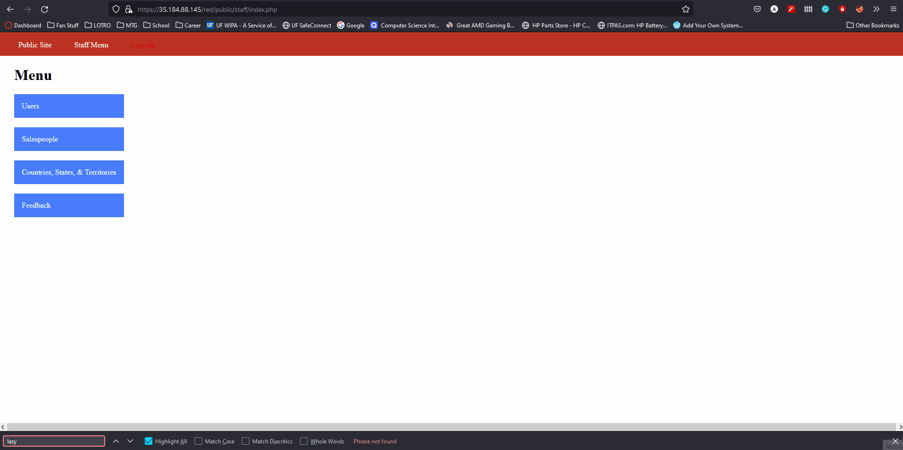
* Steps to Recreate: 
  * Navigate to RED site
  * Login with valid username: pperson and associated password
  * Navigate to the salesperson information page
  * Observe both Lazy Lazerman and Test McTesterson, private representatives
  * Log out
  * Navigate to the salespeople list on the public page of the RED site
  * Navigate to a public user's page, example Robert Hamilton
  * Manipulate the PHP id within the url to 10 to access Test McTesterson's page
  * Manipulate the PHP id within the url to 11 to access Lazy Lazerman's page

**3 SQL Injection**
* Exploit Summary: Obtain access to usernames via SQL Injection
  * Site: BLUE
* Gif: 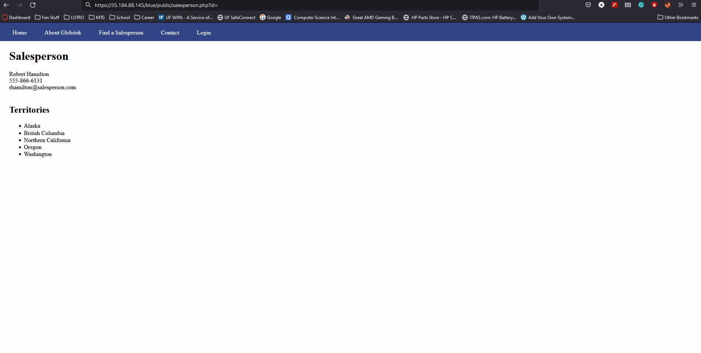
* Steps to Recreate: 
  * Navigate to BLUE site
  * Navigate to the salespeople list on the public page of the BLUE site
  * Navigate to a public user's page, example Robert Hamilton
  * Manipulate the PHP id within the url to include the following SQL query: ```' OR SLEEP(3)=0--'```
  * Observe how the page waits three seconds, then refreshes to the default user's, user id = 1, page
  * I tested if an AND query would result in a successful injection by manipulating the PHP id within the url to include the following SQL query: ```7' AND SLEEP(3)=0--'```
  * Observe how the page waits three seconds, then refreshes to the specified user page

**4. Cross-Site Scripting**
* Exploit Summary: Obtain information about exploiting XSS
  * Site: GREEN
* Gif: 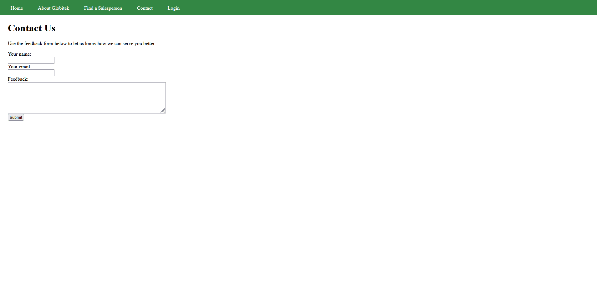
* Steps to Recreate: 
  * Navigate to GREEN site
  * Navigate to contact us form
  * Fill Name and Email fields
  * Enter script into the comment field: ```<script>alert('Austin found the XSS!');</script```
  * Submit the form
  * Login with valid username: pperson and associated password
  * Navigate to the feedback page
  * Observe the script being run through the popup that displays: Austin found the XSS!

**5. Cross-Site Request Forgery**
* Exploit Summary: Obtain information about exploiting CSRF
  * Site: RED
* Gif: 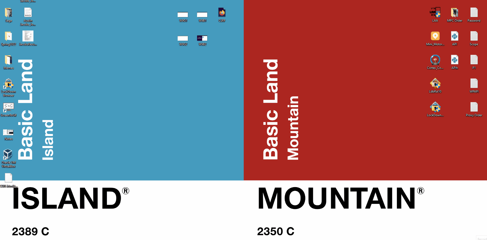
* Steps to Recreate: 
  * Design a CSRF html form   
  * Navigate to RED site
  * Login with valid username: pperson and associated password
  * Navigate to the salespeople list on the RED site
  * Open the CSRF html form: [Form](https://github.com/Austin-Jacobs/codePathweek9/blob/main/CSRF.html)
  * Refresh the salespeople page
  * Observe that there is now a salesperson H4NK H4CK3R

**6. Session Hijacking/Fixation**
* Exploit Summary: Obtain information about exploiting Session Hijacking
  * Site: BLUE
* Gif: 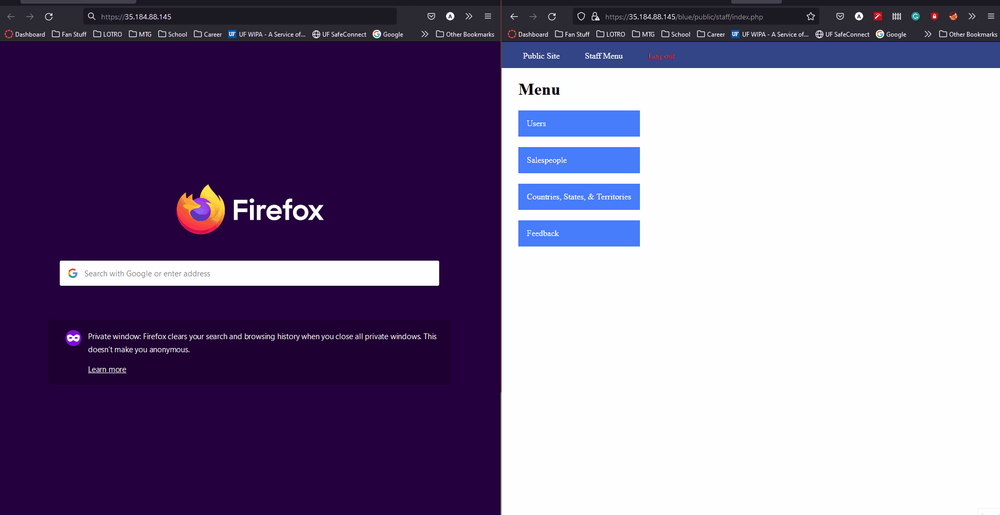
* Steps to Recreate: 
  * Navigate to BLUE site
  * Login with valid username: pperson and associated password
  * Navigate to https://35.184.88.145/ in a private window
  * Navigate to login screen in private window
  * Observe that session is not logged in
  * Navigate to https://35.184.88.145/blue/public/hacktools/change_session_id.php in non-private window
  * Navigate to https://35.184.88.145/blue/public/hacktools/change_session_id.php in private window
  * Change session ID of private window to session id of non-private window
  * Observe that private window now is logged in as user pperson
# Honeypot Assignment

**Time spent:** **2** hours spent in total

**Objective:** Create a honeynet using MHN-Admin. Present your findings as if you were requested to give a brief report of the current state of Internet security. Assume that your audience is a current employer who is questioning why the company should allocate anymore resources to the IT security team.

### MHN-Admin Deployment (Required)
**Summary:** I deployed a MHN-Admin machine using GCP. I executed the following commands on my local machine. to set up the MHN-Admin firewall and machine
* ```gcloud compute firewall-rules list```
* ```gcloud compute firewall-rules create http \```
   * ```--allow tcp:80 \```
   * ``` --description="Allow HTTP from Anywhere" \```
   * ```--direction ingress \```
   * ```--target-tags="mhn-admin"```
* ```gcloud compute firewall-rules create honeymap \```
   * ```--allow tcp:3000 \```
   * ```--description="Allow HoneyMap Feature from Anywhere" \```
   * ```--direction ingress \```
   * ```--target-tags="mhn-admin"```
* ```gcloud compute firewall-rules create hpfeeds \```
   * ```--allow tcp:10000 \```
   * ```--description="Allow HPFeeds from Anywhere" \```
   * ```--direction ingress \```
   * ```--target-tags="mhn-admin" ```
* I then deployed a MHN-Admin machine with the following command: ```gcloud compute instances create "mhn-admin" \```
   * ```--machine-type "n1-standard-1" \```
   * ```--subnet "default" \```
   * ```--maintenance-policy "MIGRATE" \```
   * ```--tags "mhn-admin" \```
   * ```--image-family "ubuntu-minimal-1804-lts" \```
   * ```--image-project "ubuntu-os-cloud" \```
   * ```--boot-disk-size "10" \```
   * ```--boot-disk-type "pd-standard" \```
   * ```--boot-disk-device-name "mhn-admin"```
* This allowed me to establish a connection to the MHN-Admin machine with the following command: ```gcloud compute ssh mhn-admin```
   * 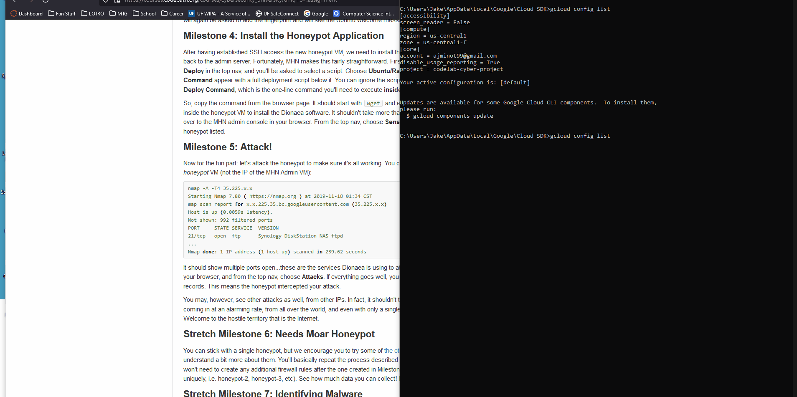
   * I then retrieved the latest packages and installed some dependencies with the following commands: ```sudo apt update``` and ```sudo apt install git python-magic -y ```
   * I then downloaded MHN, patched its python package requirements file and installed with the following commands: 
   * ```cd /opt/```
   * ```sudo git clone https://github.com/pwnlandia/mhn.git```
   * ```cd mhn/```
   * ```sudo sed -i 's/Flask-SQLAlchemy==2.3.2/Flask-SQLAlchemy==2.5.1/g' server/requirements.txt```
   * ```sudo ./install.sh```
### Dionaea Honeypot Deployment (Required)

**Summary:** The Dionaea Honeypot seeks to provide an avenue for malicious users to send malware via open networks into a pre-quarantined machine. This both exposes security flaws in the network and provides copies of the malware sent. 
* I executed the following commands on my local machine. to set up the Dionaea Honeypot
* ```gcloud compute firewall-rules create wideopen \```
    * ```--description="Allow TCP and UDP from Anywhere" \```
    * ```--direction ingress \```
    * ```--priority=1000 \```
    * ```--network=default \```
    * ```--action=allow \```
    * ```--rules=tcp,udp \```
    * ```--source-ranges=0.0.0.0/0 \```
    * ```--target-tags="honeypot"```
* gcloud compute instances create "honeypot-1" \```
    * ```--machine-type "n1-standard-1" \```
    * ```--subnet "default" \```
    * ```--maintenance-policy "MIGRATE" \```
    * ```--tags "honeypot" \```
    * ```--image-family "ubuntu-minimal-1804-lts" \```
    * ```--image-project "ubuntu-os-cloud" \```
    * ```--boot-disk-size "10" \```
    * ```--boot-disk-type "pd-standard" \```
    * ```--boot-disk-device-name "honeypot-1"```
* ```wget "http://34.136.64.199/api/script/?text=true&script_id=2" -O deploy.sh && sudo bash deploy.sh http://34.136.64.199 tAudpjLC```
    * 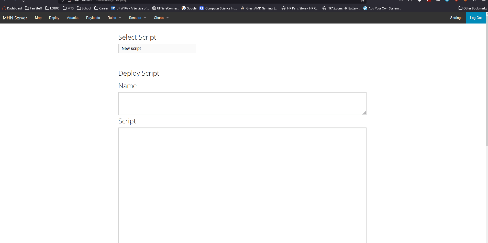

### Database Backup (Required) 

**Summary:** The exported JSON files holds records of the attacks against the established honeypot including port, honeypotname, source and intended port name, and a unique identifier.
* To extract the JSON file I ran the following commands: 
  * ```mongoexport --db mnemosyne --collection session > session.json```
  * ```truncate --size="<5M" session.json```
  * ```gcloud compute scp mhn-admin:~/session.json ./session.json```

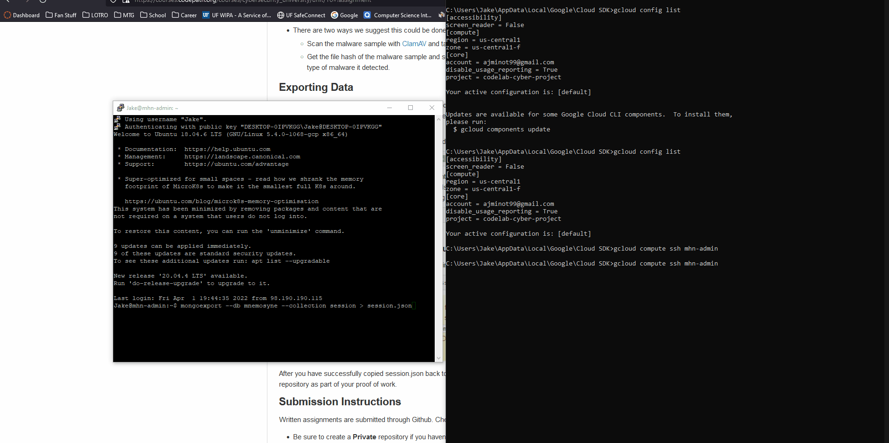

## Notes
I did not encounter any challenges during this assignment

